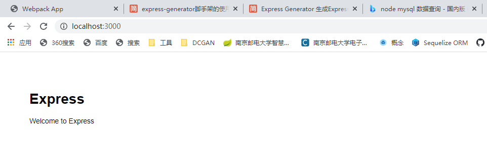

## 使用express generator生成 express 应用的目录结构

1. 快速创建一个Express应用框架

```
npm install express-generator -g

express todoServer --view=pug

cd todoServer

npm install

SET DEBUG=todoServer:* & npm start
```

遇到成功安装express和express-generator之后express指令不起作用的问题，终端窗口输入`express --version`显示'express' 不是内部或外部命令，也不是可运行的程序或批处理文件。

解决：通常遇到这种问题时需要添加环境变量，教研室的win10系统，安装了nvm来管理node版本，当前项目的node版本为`v10.24.0`，找到该版本的node安装路径，会发现没有node_global文件夹，所以需要在终端先设置全局安装路径，即:`npm config set prefix "C:\Users\Administrator\AppData\Roaming\nvm\v10.24.0\node_global"`，然后再重新全局安装express和express-generator，安装完成后就会发现node_global下有了express，在该目录下cmd打开终端输入`express --version`检测是否安装成功！安装的express版本号为`4.16.1`。接下来，添加环境变量，即在系统变量新建一个`NODE_PATH`，值为`C:\Users\Administrator\AppData\Roaming\nvm\v10.24.0\node_global`，然后在path中添加一个`%NODE_PATH%`即可。

win+R -> cmd 打开终端之后输入`express --version`会正常显示express的版本号，表示安装成功。但是又会发现在vscode终端输入`express --version`还是显示'express' 不是内部或外部命令，也不是可运行的程序或批处理文件，此时关闭vscode，然后以管理员身份运行即可。

2. 设置nodemon

`npm install --save-dev nodemon`
nodemon的作用：每次修改文件后会自动重启express服务。

修改package.json文件：
```javascript
"scripts": {
  "start": "node ./bin/www",
  "serve": "nodemon ./bin/www"
}
```
启动服务的时候使用：`SET DEBUG=todoServer:* & npm run serve`

浏览器中输入: `http://localhost:3000`，会看到创建好的Express应用，页面显示如下：



3. 创建生成的文件目录结构

```javascript
|- todoServer
    |- app.js
    |- bin
        www
    |- package.json
    |- node_modules
        [about 4,500 subdirectories and files]
    |- public
        |- images
        |- javascripts
        |- stylesheets
            style.css
    |- routes
        index.js
        users.js
    |- views
        error.pug
        index.pug
        layout.pug
```

- `app.js`：应用的真正入口，总路由 (其他的路由 要由它来分配)，代码结构分析如下：

将之前安装的包导入进去，然后创建express对象：
```javascript
var createError = require('http-errors');
var express = require('express');
var path = require('path');
var cookieParser = require('cookie-parser');
var logger = require('morgan');

var app = express();
```

设置模板，views设置模板的位置，view engine设置要使用的模板引擎：
```javascript
// view engine setup
app.set('views', path.join(__dirname, 'views'));
app.set('view engine', 'pug');
```

调用之前引入的包：
```javascript
app.use(logger('dev'));
app.use(express.json());
app.use(express.urlencoded({ extended: false }));
app.use(cookieParser());
app.use(express.static(path.join(__dirname, 'public')));
```

引入路由文件，并关联路由路径与引入的文件：
```javascript
var indexRouter = require('./routes/index');
var usersRouter = require('./routes/users');

app.use('/', indexRouter);
app.use('/users', usersRouter);
```

处理错误的http请求：
```javascript
// catch 404 and forward to error handler
app.use(function(req, res, next) {
  next(createError(404));
});

// error handler
app.use(function(err, req, res, next) {
  // set locals, only providing error in development
  res.locals.message = err.message;
  res.locals.error = req.app.get('env') === 'development' ? err : {};

  // render the error page
  res.status(err.status || 500);
  res.render('error');
});
```


- `bin/www`：应用的主入口，在该文件内部首先引入真正入口app.js，然后创建了一个HTTP Server
- `package.json`：包描述文件
- public文件目录：存放所有的前端静态资源html css image  js
- routes文件目录：路由文件(默认有两个)，路由主要定义url和资源的映射关系(一一对应关系)主要用来接收前端发送的请求，响应数据给前端，以user.js为例：
  ```javascript
  // 加载express，通过express获取到router对象
  var express = require('express');
  var router = express.Router();

  /* GET users listing. */
  // 使用router对象指定路由的方法和路径,
  // 由于在app.js已经指定 /users 到本文件，因此当浏览器请求/user时，会执行下面的回调函数
  router.get('/', function(req, res, next) {
    // 回调函数有第三个参数next，主要用于中间件中，即将数据传递到下一个方法去处理
    res.send('respond with a resource');
  });

  module.exports = router;
  ```
- views文件目录：主要放置 ejs 后端模板文件，默认使用的是 pug 模板，views文件里面是所有的视图模板。在router文件里， 使用Response.render()指定要加载的模板和传递给模板的一些参数。比如在`route/index.js`文件中：
  ```javascript
  var express = require('express');
  var router = express.Router();

  /* GET home page. */
  router.get('/', function(req, res, next) {
    res.render('index', { title: 'Express' });
  });

  module.exports = router;
  ```
  index.pug文件如下：
  ```javascript
  extends layout

  block content
    h1= title
    p Welcome to #{title}
  ```
  传递进来的title的值将会被替换。所以页面上显示的是`Welcome to Express`。

4. Express应用开发[官网文档参考](https://expressjs.com/en/guide/routing.html)